# plotSurfaceROIBoundary

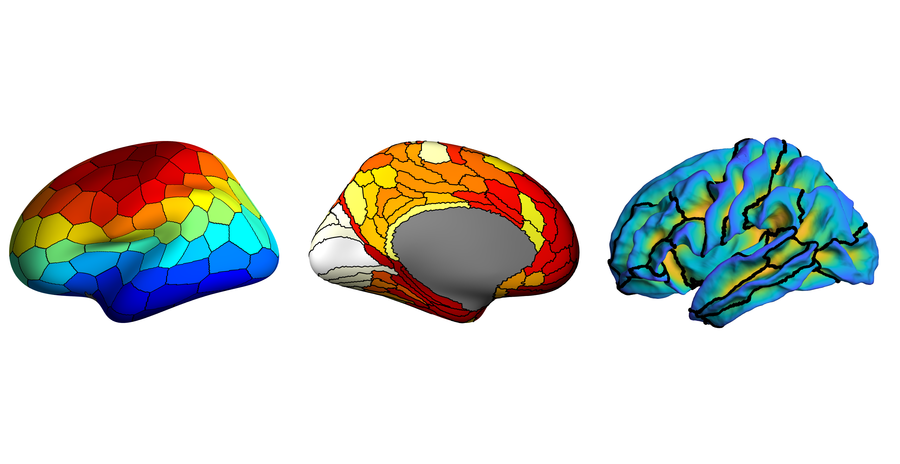

These MATLAB scripts will plot the boundaries of a ROI on a surface. Additionally code is provided so that certain regions can be excluded from the colourmap.

There are five ways of defining a boundary here (I know right? Overkill!!), 'faces', 'midpoint', 'centroid', 'edge_vertices', and 'edge_faces'.

## How to run

The code can be run as follows:

```
p = plotSurfaceROIBoundary(surface,vertex_id,data2plot,boundaryMethod,cmap,boundaryWidth);
```

surface is a structure with the fields 'vertices' and 'faces', which define the vertices and faces of the surface respectively.

vertex_id is a vector with the ROI ID of each vertex.

data2plot is a vector of data to plot for each ROI or each vertex.

boundaryMethod is one of 'faces', 'midpoint', 'centroid', 'edge_vertices' or 'edge_faces' (see below).

cmap is the colormap you wish to use.

boundaryWidth is a scalar indicating the width of the boundary.

## Examples of types of plots

The simplist way is to just plot some data for each ROI and use this code to highlight the boundaries/borders of each ROI:

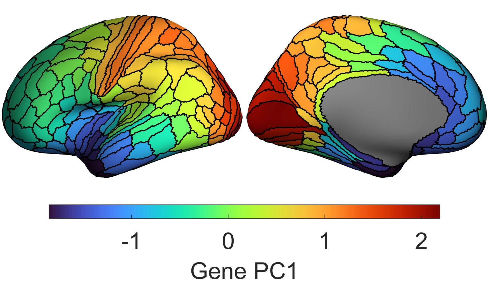

You can also project a parcellation onto continuous variations along a surface:

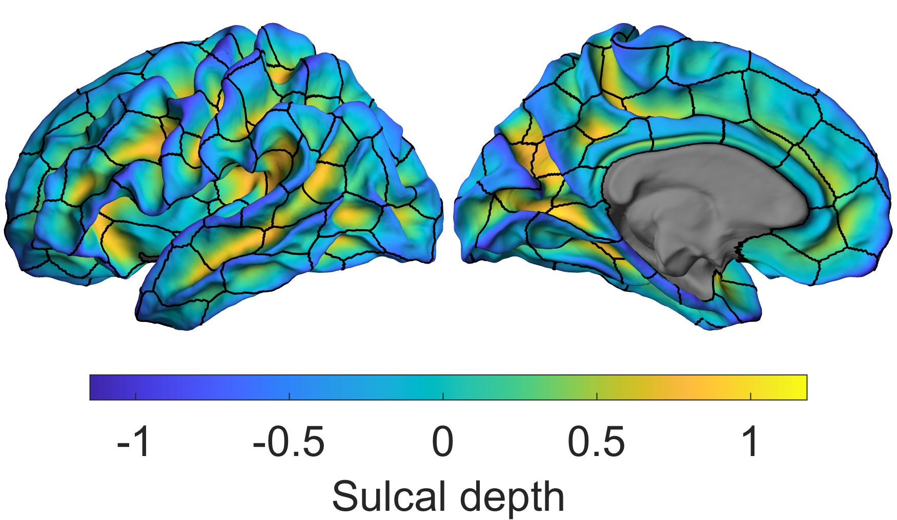

Plot the parcellation on the surface, then draw the boundaries of another (note you could also plot the boundaries of multiple parcellations if you so wished):

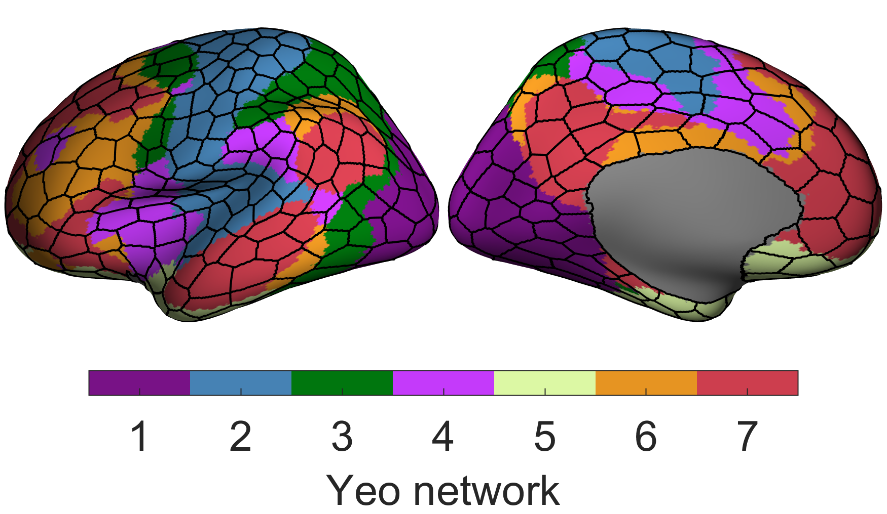

Additionally the code allows you to easily control if a colour should even be displayed for a given region (i.e., you might want to exclude the medial wall from being displayed or show thresholded data):

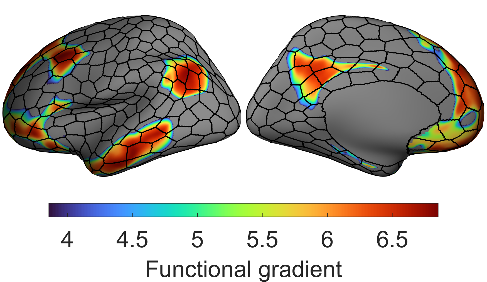

You can also threshold on a per ROI basis:

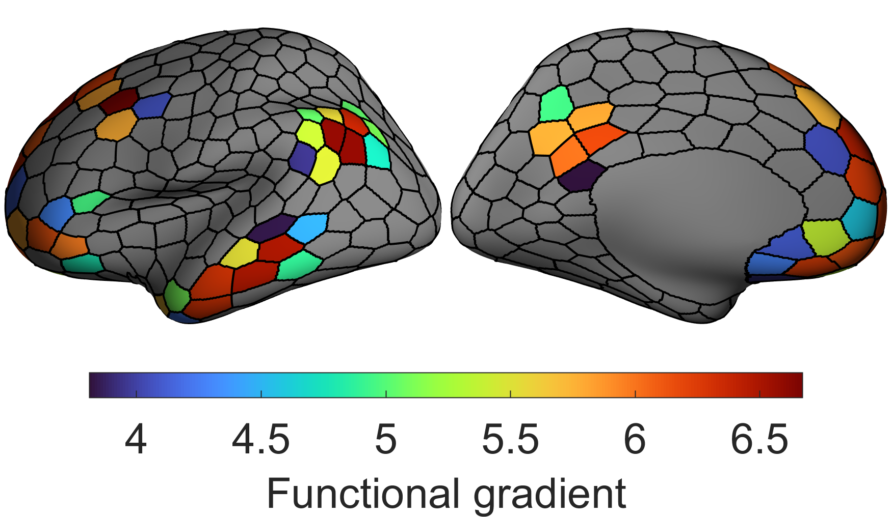

You can even 'threshold' the borders (quite why you would want to I don't know):

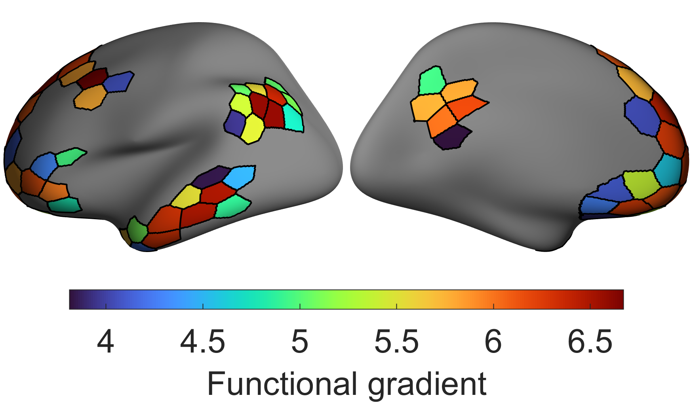

If the ROIs are not sequentially numbered (like you get from an .annot file), the code can adapt to this (makes more sense if you see the script):

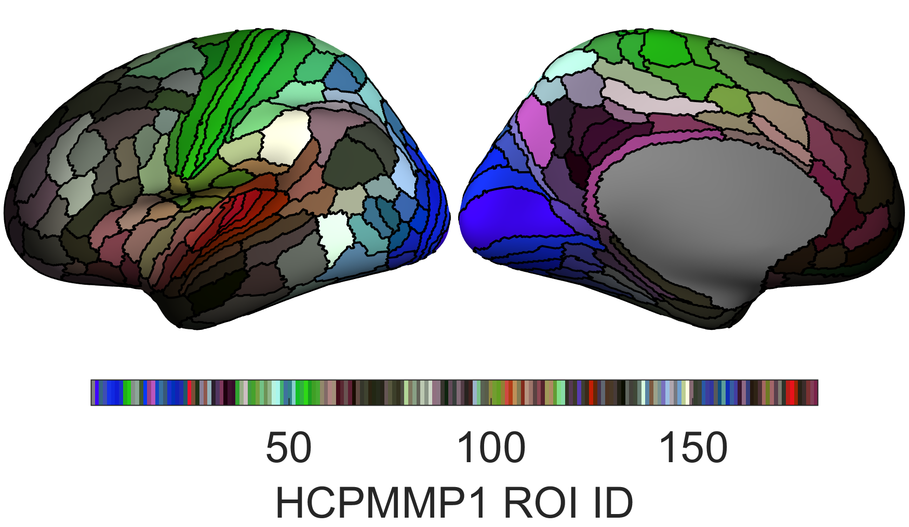

The script demo_ExampleSurfacePlotFunction.m will reproduce all of the above plots

## Types of boundary plotting methods

'faces' will find the faces which exist between ROIs and those will be coloured black to specify the boundary. 

'midpoint' finds the edges that connect the vertices of two different ROIs and takes the midpoint of the edge and uses those coordinates to define the boundary. 

'centroid' finds the faces which exist between ROIs and uses the centroid of those to draw the coordinates that define the boundary. 

'edge_vertices' finds the vertices which define the boundary of the ROI and draws the boundary along those (i.e., follows the edges between the vertices which make up the ROI boundary). 

'edge_faces' finds the edges which are part of two faces with different ROIs and draws the boundary along those.

(see the images below if these descriptions are too confusing)

demo_plotSurfaceROIBoundary.m shows examples of the different boundary methods. See plotSurfaceROIBoundary.m, makeFaceVertexCData.m, and findROIboundaries.m for a more detailed description. I personally recommend using 'midpoint', visually it looks the cleanest and you can easily change the thickness/width of the boundary. 'faces' will look clean but you cannont change the thickness/width, 'centroid' doesn't look especially neat but you can change the thickness, while with 'edge_vertices' the boundaries of adjacent ROIs will leave a slight gap between them (i.e. they don't overlap) which can look a bit strange. 'edge_faces' can look highly irregular when zoomed in.

See makeFaceVertexCData.m for how to configure a colormap to exclude certain regions (e.g., regions which have no ROI information). This function works by assigning a colour directly to each face/vertex instead of getting MATLAB to automatically do it. This allows for somewhat easier manipulation (and it is easier to have multiple colour maps in a plot this way!).

surface_data.mat includes vertices and faces for fsaverage, along with parcellations for the Desikan-Killiany atlas, HCPMMP1 parcellation, a random 200/500 (100/250 ROIs per hemisphere) parcellation, and all the Schaefer 7 network parcellations.

example_data.mat includes some example data to plot on the surface

## Boundary examples

The first five figures show the different types of boundary method projected over the surface where each face is coloured according to the vertex ROI IDs (each vertex is a dot coloured according to its ROI ID). While a face can be connected to multiple ROIs, each face is colored by the value of the first vertex that constitutes that face (in other words, when plotting each face appears to only be assigned to one ROI when it infact belongs to multiple). This is why for 'midpoint', 'centroid', and 'edge_vertices' the boundary drawn doesn't exactly follow the face colours. Anatomically based parcellations (like the Desikan-Killiany and HCPMMP1 parcellations) tend to produce jagged boundaries in my experience. All these figures can be replicated using demo_plotSurfaceROIBoundary.m

'faces'

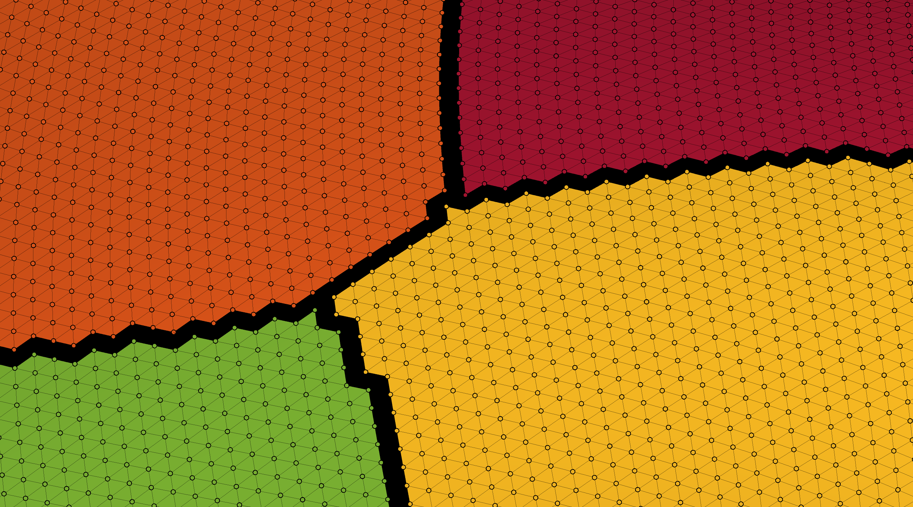

'midpoint'


'centroid'

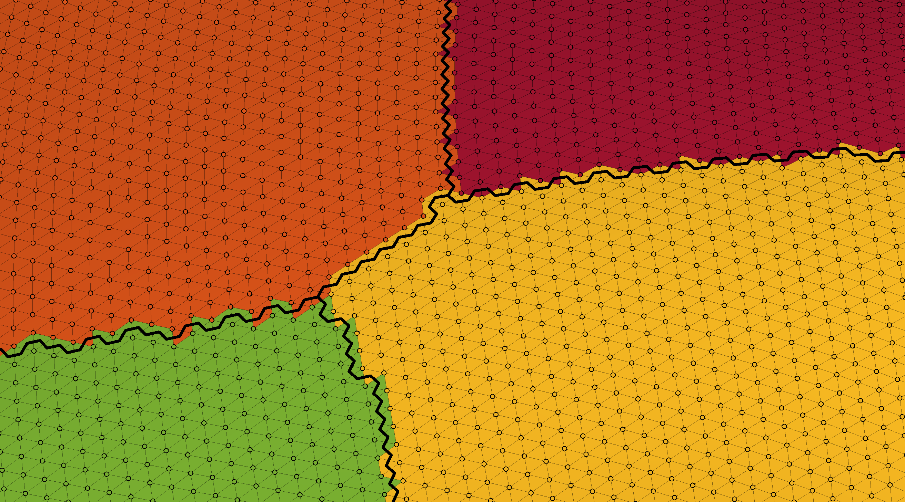

'edge_vertices'


'edge_faces'

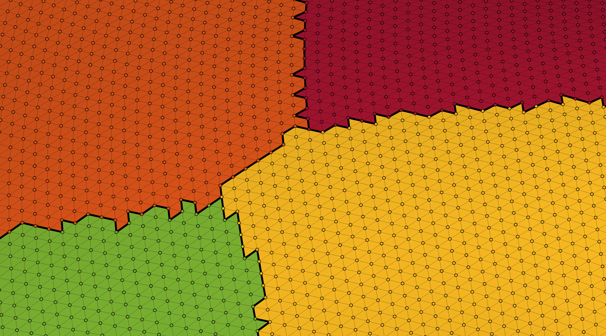

The next five figures show the different types of boundary method projected over the surface where each face is coloured according to an interpolated value of the vertex values (which in this case is the sulcal depth of each vertex).

'faces'

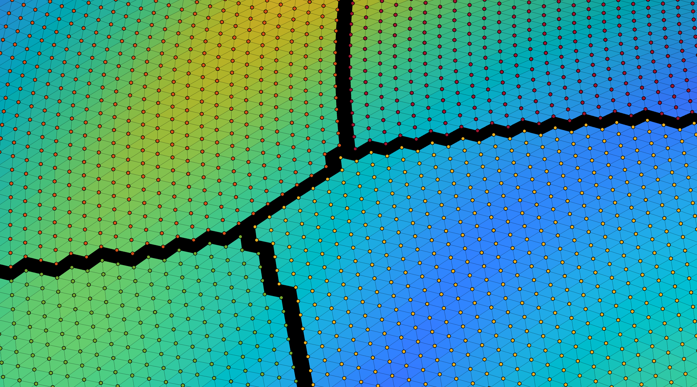

'midpoint'


'centroid'


'edge_vertices'

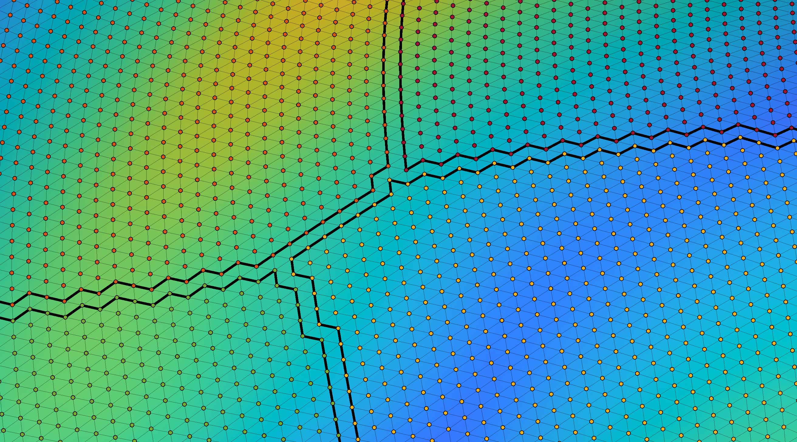

'edge_faces'

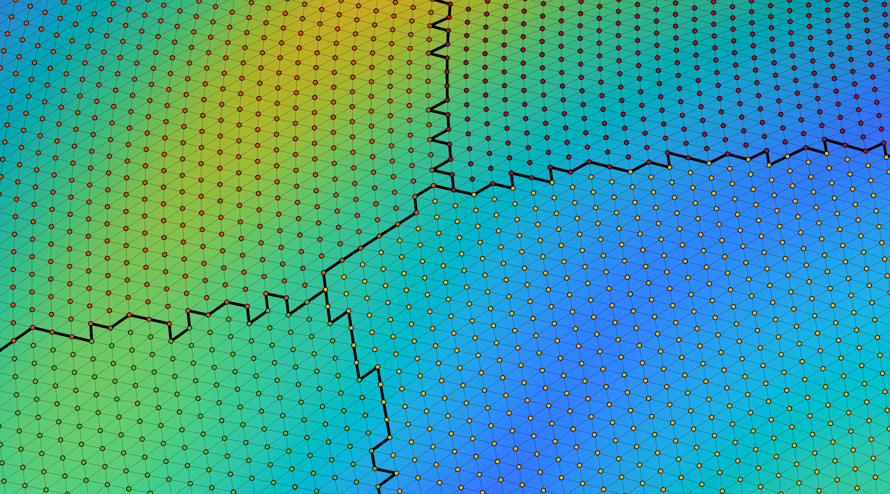

## But Stuart how does it all work!?!

The gist is, a triangular mesh is just a graph. Vertices which are on the boundary of a region will have edges that connect not only to other vertices that make up that region, but edges to vertices of other regions as well. Therefore all we need to do is find vertices whose neighbours (i.e., other vertices they are directly connected by an edge to) are from a different region (essentially we are just pulling out subnetworks). Then you can use this information to plot a boundary in the different ways I discussed above. 

## Issues

If the surface of a particular region is very complex many of the boundary plotting approaches may not work especially well. My code makes some assumptions and these can be violated at times. However I have found that these issue are only noticeable if you zoom all the way in. If in doubt, the 'faces' method should be fairly robust to weirdness. If the mesh is a flat mesh this code is also unlikely to work (except perhaps for the 'faces' option).Also if the mesh has any holes in it, you may get strange results, but that is your fault for using a mesh with a hole in it :)

There are also better ways to structure the functions to ensure they handle inputs better. One day I will get around to coding them that way, one day....

## Contact

Reach me at stuart.oldham@mcri.edu.au if you have any questions or issues (or just to tell me you are using it!)
